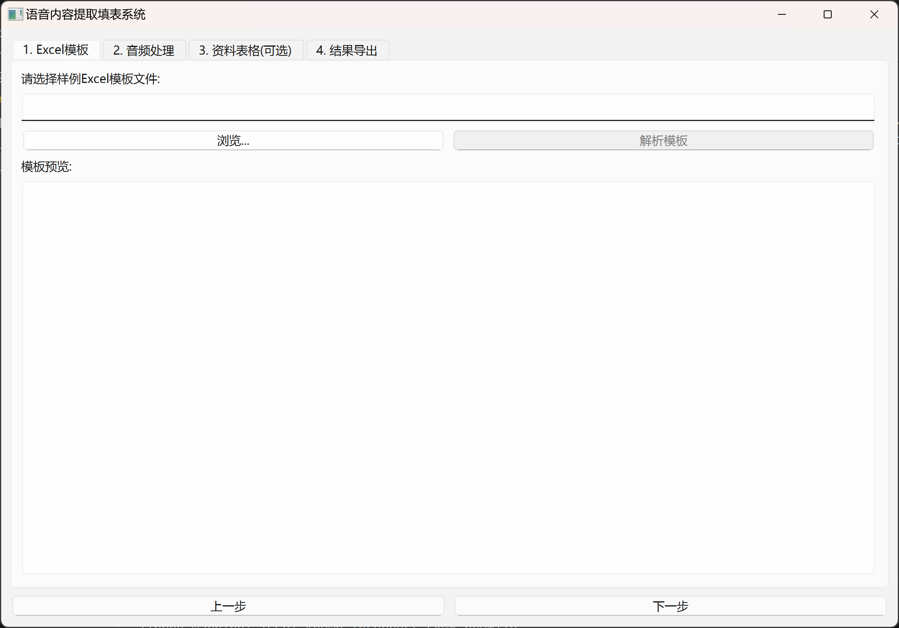
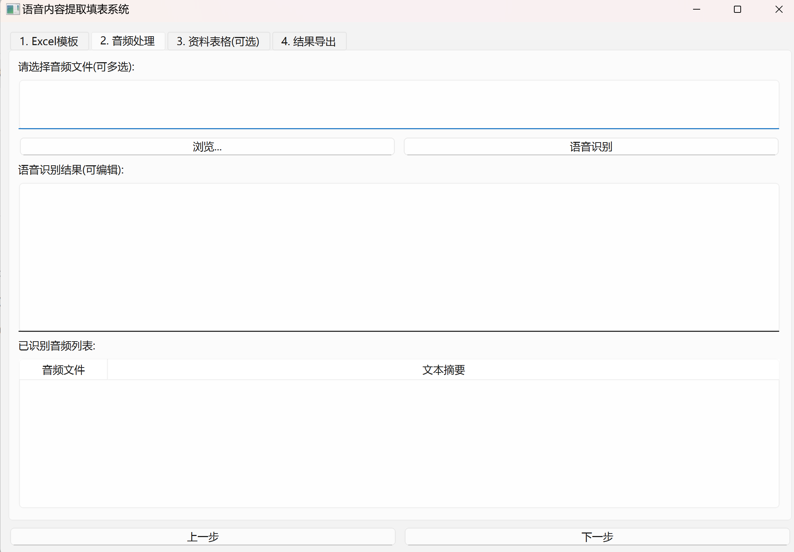
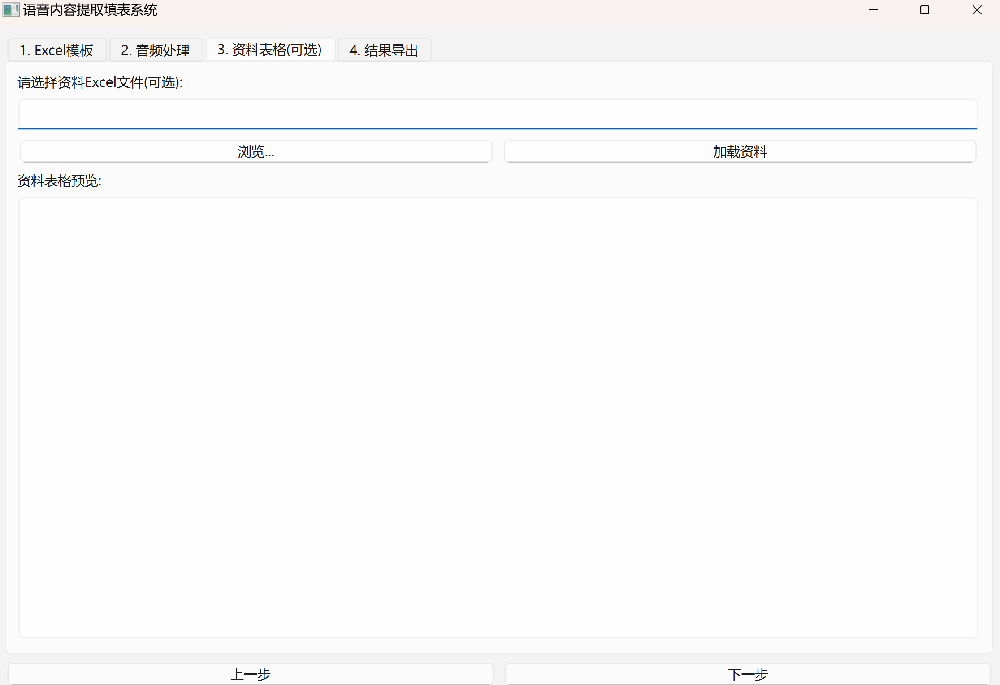
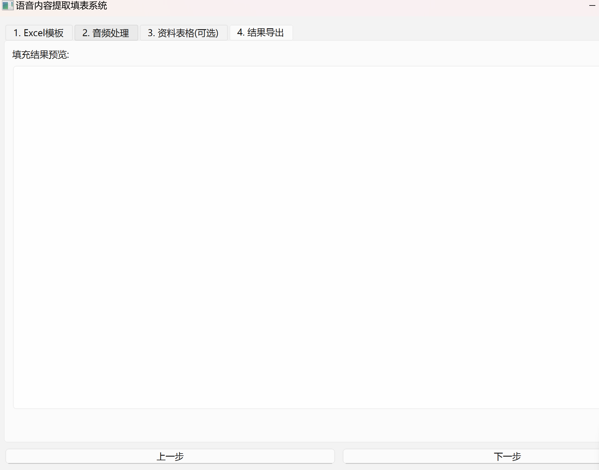
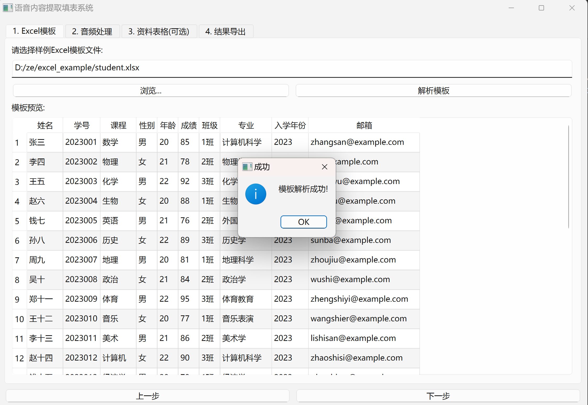

# -# 语音内容提取填表系统


一个基于PyQt6的GUI应用程序，用于从语音文件中提取内容并填充到Excel模板中。

## 功能特点

- 🎤 支持多种音频格式(WAV, MP3等)
- 📊 Excel模板解析与预览
- ✏️ 识别文本编辑功能
- 📥 结果导出为Excel文件
- 🖥️ 用户友好的界面设计

## 截图展示

### 核心界面展示
|  |  |
|----------------------------------|--------------------------------|
|    |  |

### 数据处理流程

## 安装与使用

1. 克隆仓库:
   ```bash
   git clone https://github.com/你的用户名/SpeechToExcel.git
